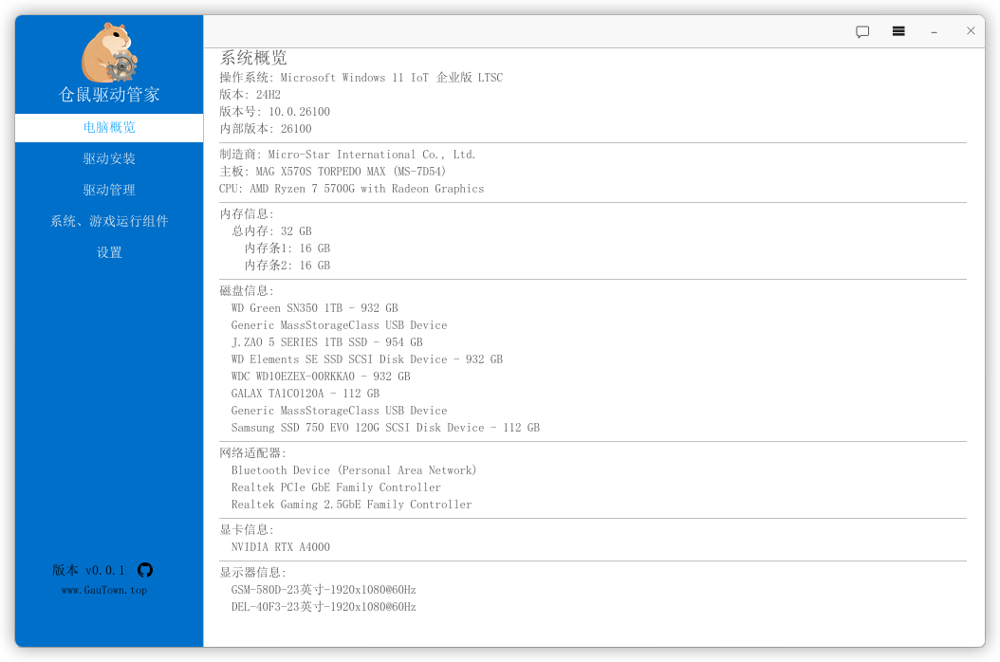

# 仓鼠驱动管家 (Hamster Driver Manager)

一个现代化的 Windows 驱动管理工具，采用 Rust 语言开发，提供直观的图形界面，帮助用户轻松管理和维护系统驱动程序。



## 🚀 主要功能

### 🔍 系统信息检测
- **硬件信息**：CPU、内存、硬盘、显卡等详细信息
- **显示器信息**：分辨率、刷新率、品牌型号等EDID信息
- **网络适配器**：网卡型号和状态信息

### 💾 驱动管理
- **驱动扫描**：自动扫描系统中已安装的驱动程序
- **驱动状态**：显示驱动版本、签名状态、文件路径等信息
- **驱动备份**：支持驱动程序的备份和恢复功能
- **签名验证**：验证驱动文件的数字签名安全性

### 🔧 系统优化
- **依赖分析**：分析驱动程序之间的依赖关系
- **问题诊断**：识别和解决驱动相关问题
- **性能监控**：实时监控驱动运行状态

## 🛠️ 技术特性

### 核心技术
- **Rust 语言**：内存安全、高性能的系统级编程语言
- **egui 框架**：轻量级、跨平台的即时模式GUI
- **Windows API**：深度集成Windows系统功能

### 架构设计
- **前后端分离**：清晰的模块化架构设计
- **异步处理**：避免UI阻塞，提升响应速度
- **错误处理**：完善的错误处理和用户反馈

### 用户体验
- **现代化界面**：简洁直观的用户界面设计
- **多语言支持**：完整的中文界面支持
- **高DPI适配**：支持高分辨率显示器

## 📦 安装指南

### 系统要求
- **操作系统**：Windows 10 或更高版本
- **Rust 工具链**：Rust 1.93.0+
- **构建工具**：MinGW-w64 或 Visual Studio Build Tools

### 从源码构建

```bash
# 克隆仓库
git clone https://github.com/Gautown/HamsterDrivers.git
cd HamsterDrivers

# 构建发布版本
cargo build --release

# 运行程序
cargo run

# 或者直接运行构建后的可执行文件
./target/release/hamster-driver-manager.exe
```

### 使用构建脚本

项目提供了便捷的构建脚本：

```powershell
# 使用 PowerShell 脚本构建
.\build.ps1

# 使用批处理脚本构建
package.bat
```

### 预编译版本

可以从 [Releases 页面](https://github.com/Gautown/HamsterDrivers/releases) 下载预编译的可执行文件。

## 🎯 使用说明

### 首次运行
1. 启动程序后，系统将自动扫描硬件信息
2. 程序会检测系统中已安装的驱动程序
3. 主界面显示系统概览和驱动列表

### 驱动管理操作
- **查看驱动详情**：点击驱动列表中的项目查看详细信息
- **备份驱动**：选择驱动后使用备份功能
- **验证签名**：检查驱动文件的数字签名状态
- **导出报告**：生成系统驱动信息报告

### 系统信息查看
- 左侧面板显示系统硬件概览
- 右侧面板显示详细的驱动信息
- 底部状态栏显示程序版本和系统状态

## 🏗️ 项目结构

```
HamsterDrivers/
├── src/
│   ├── Core/                 # 核心功能模块
│   │   ├── driver_manager.rs # 驱动管理逻辑
│   │   ├── edid.rs          # 显示器信息处理
│   │   ├── sysinfo.rs       # 系统信息获取
│   │   ├── features/        # 功能模块
│   │   └── windows_api/     # Windows API 封装
│   ├── gui/                 # 图形界面模块
│   └── main.rs              # 程序入口点
├── assets/                  # 资源文件
│   └── icons/              # 图标文件
├── dist/                   # 发布版本目录
└── build.ps1              # 构建脚本
```

## 🔧 开发指南

### 环境配置

```bash
# 安装 Rust 工具链
curl --proto '=https' --tlsv1.2 -sSf https://sh.rustup.rs | sh

# 安装 Windows 目标
rustup target add x86_64-pc-windows-gnu

# 安装构建依赖（Windows）
# 需要安装 MinGW-w64 或 Visual Studio Build Tools
```

### 开发命令

```bash
# 开发模式运行
cargo run

# 调试构建
cargo build

# 发布构建
cargo build --release

# 运行测试
cargo test

# 代码格式化
cargo fmt

# 代码检查
cargo clippy
```

### 贡献指南

1. Fork 本仓库
2. 创建功能分支 (`git checkout -b feature/AmazingFeature`)
3. 提交更改 (`git commit -m 'Add some AmazingFeature'`)
4. 推送到分支 (`git push origin feature/AmazingFeature`)
5. 创建 Pull Request

## 📊 技术栈详情

### 主要依赖

- **eframe/egui**：现代化的GUI框架
- **windows**：Windows API绑定
- **sysinfo**：系统信息获取
- **wmi**：Windows管理规范接口
- **image**：图像处理库
- **resvg/usvg**：SVG图标渲染支持

### 构建配置

项目使用标准的 Cargo 构建系统，支持跨平台编译，主要针对 Windows 平台优化。

## 🐛 问题反馈

如果您遇到任何问题或有改进建议，请通过以下方式反馈：

1. 在 [Issues](https://github.com/Gautown/HamsterDrivers/issues) 页面创建新问题
2. 描述问题的详细情况和复现步骤
3. 提供系统环境和错误日志信息

## 📄 许可证

本项目采用 MIT 许可证 - 查看 [LICENSE](./LICENSE) 文件了解详情。

## 🙏 致谢

感谢所有为项目做出贡献的开发者，以及使用的开源库的维护者。

## 🔗 相关链接

- [GitHub 仓库](https://github.com/Gautown/HamsterDrivers)
- [问题反馈](https://github.com/Gautown/HamsterDrivers/issues)
- [最新版本](https://github.com/Gautown/HamsterDrivers/releases)

---

**仓鼠驱动管家** - 让驱动管理变得简单高效！